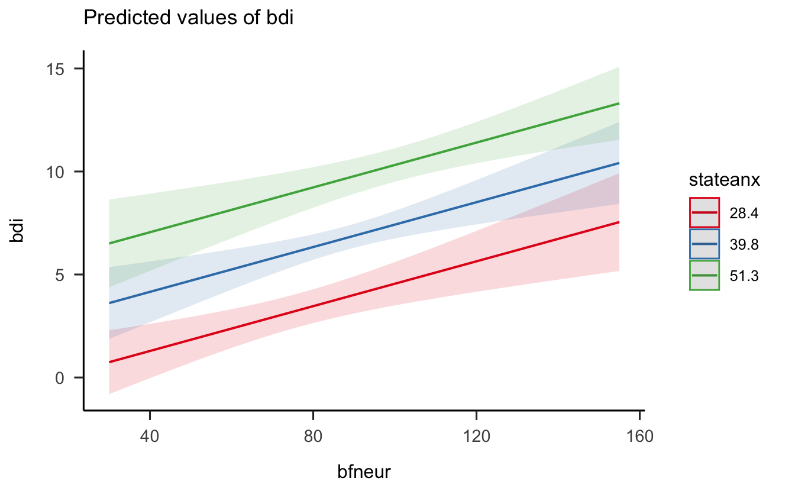
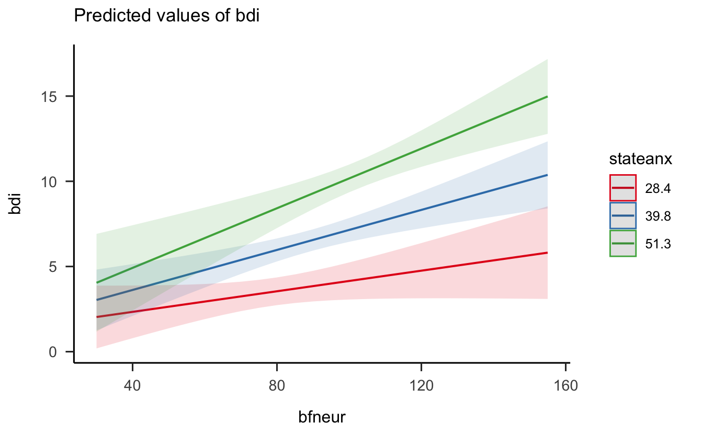

# Una breve introduzione al modello di regressione 


In questo capitolo verrà presentata un'introduzione "pratica" all'analisi della regressione, nella quale ci preoccuperemo di capire a cosa serve a come si interpretano i risultati che tale metodo statistico produce. Nel capitolo successivo, gli stessi argomenti verranno trattati in un modo più "formale" e con maggiori approfondimenti teorici. Questo capitolo contiene _tutto quello che c'è da sapere_ e _non si può non sapere_ su questo argomento. L'ho pensato per i miei laureandi, ovvero per degli studenti che devono usare queste procedure statistiche per risolvere un problema pratico (quello di concludere la tesi). L'altro capitolo è più convenzionalmente "didattico" ed è stato pensato in primo luogo per chi deve dare l'esame di Psicometria. Questo primo capitolo su questo tema può essere dunque pensato come un'introduzione "gentile" a ciò che verrà discusso nel prossimo capitolo.

## Regressione bivariata

La regressione bivariata si pone il problema di descrivere la relazione statistica _lineare_ che intercorre tra due variabili, $x$ e $y$. Per relazione "statistica" intendo dire che, nel caso dei dati campionari $\{x, y\}$ di cui si occupa il modello di regressione, non c'è mai una "perfetta" relazione lineare (ovvero, i punti del diagramma a dispersione di $\{x, y\}$ non si situano su una retta).  In alcuni casi, quando guardiamo il diagramma a dispersione di $\{x, y\}$ ci rendiamo conto che, in effetti, i punti $\{x, y\}$, anche se non si dispongono su una retta, sono sparpagliati attorno ad una retta "virtuale" che passa attraverso la nube di punti. In una tale situazione (che è una delle tante possibili, non l'unica), è ragionevole descrivere la relazione tra le variabili $x$ e $y$ mediante la retta che, al meglio, __approssima__ la nube di punti nel diagramma a disperiosne.  L'analisi di regressione si pone il problema di trovare l'inclinazione di quella retta che passa il più vicino possibile ai punti del diagramma a dispersione di $\{x, y\}$. 


### Scioglimento del ghiaccio marino

Uno degli impatti più importanti dei cambiamenti climatici che stanno investendo il nostro Pianeta è la riduzione dell'estensione della calotta di ghiaccio marino artico. Esploriamo come l'estensione del ghiaccio marino artico sta cambiando nel tempo utilizzando un modello lineare. I dati sono forniti da [The National Snow and Ice Data Center](https://nsidc.org) e sono espressi in milioni di chilometri quadrati. 


I dati sono i seguenti:


```r
data.frame(seaice)
#>    year extent_north extent_south
#> 1  1979       12.328       11.700
#> 2  1980       12.337       11.230
#> 3  1981       12.127       11.435
#> 4  1982       12.447       11.640
#> 5  1983       12.332       11.389
#> 6  1984       11.910       11.454
#> 7  1985       11.995       11.618
#> 8  1986       12.203       11.088
#> 9  1987       12.135       11.554
#> 10 1988       11.923       12.131
#> 11 1989       11.967       11.426
#> 12 1990       11.694       11.410
#> 13 1991       11.749       11.545
#> 14 1992       12.110       11.399
#> 15 1993       11.923       11.420
#> 16 1994       12.011       11.774
#> 17 1995       11.415       11.795
#> 18 1996       11.841       11.769
#> 19 1997       11.668       11.390
#> 20 1998       11.757       11.738
#> 21 1999       11.691       11.761
#> 22 2000       11.508       11.747
#> 23 2001       11.600       11.673
#> 24 2002       11.363       11.222
#> 25 2003       11.397       11.969
#> 26 2004       11.240       11.961
#> 27 2005       10.907       11.695
#> 28 2006       10.773       11.461
#> 29 2007       10.474       11.687
#> 30 2008       10.978       12.239
#> 31 2009       10.932       12.049
#> 32 2010       10.711       12.107
#> 33 2011       10.483       11.501
#> 34 2012       10.406       12.004
#> 35 2013       10.897       12.524
#> 36 2014       10.790       12.776
#> 37 2015       10.566       12.414
#> 38 2016       10.151       11.156
#> 39 2017       10.373       10.693
```


Quale domanda di ricerca possiamo porci con questi dati? Propongo la seguente domanda.

__Domanda di ricerca:__ l'estensione del ghiaccio marino artico sta diminuendo nel tempo?

Per esplorare la risposta a questa domanda, iniziamo a creare una rappresentazione grafica dei dati. Dato che abbiamo due variabi continue (il tempo, espresso in anni, e l'estensione del ghiaccio marino artico, in milioni di chilometri quadrati), questi dati possono essere rappresentati graficamente mediante un diagramma a dispersione.
Vogliamo sapere come varia l'estensione del ghiaccio marino artico in funzione del tempo e quindi disegnamo i dati ponendo la variabile tempo sull'asse delle ascisse e l'estensione del ghiaccio marino artico sull'asse delle ordinate.


```r
seaice %>% 
  ggplot(aes(year, extent_north)) +
  geom_point()
```


Guardando la figura vediamo che è ragionevole descrivere mediante una retta la relazione tra l'estensione del ghiaccio marino artico (chiamiamola `y`) e il tempo (chiamiamolo `x`). Aggiungiamo al diagramma di dispersione una retta, scegliendola in modo tale che si avvicini il più possibile alla nube di punti rappresentata nel grafico. Ovviamente, è possibile scegliere tra infinite rette diverse. La retta che è rappresentata qui è stata scelta in base ad un  criterio particolare, detto "dei minimi quadrati". Vedremo meglio in seguito cosa questo significa. Per ora ci accontentiamo di riconoscere che la nostra è una buona scelta, per gli scopi presenti.


```r
seaice %>% 
  ggplot(aes(year, extent_north)) +
  geom_point() +
  geom_smooth(method = "lm", se = FALSE) 
#> `geom_smooth()` using formula 'y ~ x'
```


## Interpretazione dei coefficienti $a$ e $b$

La retta che abbiamo disegnato nella figura precedente rappresenta la risposta alla nostra domanda di ricerca: l'estensione del ghiaccio marino artico sta diminuendo nel tempo. 

Anziché considerare questa risposta unicamente dal punto di vista grafico, proviamo a descrivere la retta disegnata nella figura in maniera quantitativa, con dei numeri. Per fare questo, dobbiamo innanzitutto ricordare qual è l'equazione di una retta:

\begin{equation}
y = a + b \times x
\end{equation}

Prima di calcolare i coefficienti $a$ e $b$ della retta di regressione, rimaneggiamo i nostri dati. In particolare, rinominiamo le variabili e indicizziamo gli anni da 1 a 39. Nel caso presente, vogliamo sapere se l'estensione del ghiaccio marino artico dall'inizio alla fine del periodo temporale considerato, indipendentemente dal fatto che l'anno iniziale sia il 1979 e l'anno finale il 2017. Quindi sottraiamo 1979 dalle modalità della variabile `year` in modo tale che il primo punto temporale corrisponda a zero.


```r
seaice <- seaice %>% 
  mutate(
    x = year - 1979
  ) %>% 
  rename(
    y = extent_north
  )
glimpse(seaice)
#> Rows: 39
#> Columns: 4
#> $ year         <int> 1979, 1980, 1981, 1982, 1983, 1984, 1985, 1986, 1987, 19…
#> $ y            <dbl> 12.328, 12.337, 12.127, 12.447, 12.332, 11.910, 11.995, …
#> $ extent_south <dbl> 11.700, 11.230, 11.435, 11.640, 11.389, 11.454, 11.618, …
#> $ x            <dbl> 0, 1, 2, 3, 4, 5, 6, 7, 8, 9, 10, 11, 12, 13, 14, 15, 16…
```
Il diagramma a dispersione avrà ora la forma seguente:


```r
seaice %>% 
  ggplot(aes(x, y)) +
  geom_point() +
  geom_smooth(method = "lm", se = FALSE) 
#> `geom_smooth()` using formula 'y ~ x'
```


Per trovare i coefficienti $a$ e $b$ della retta di regressione possiamo usare, ad esempio, la funzione `lm()`:


```r
fm <- lm(y ~ x, data = seaice)
coef(fm)
#> (Intercept)           x 
#> 12.50131410 -0.05457389
```

L'output della funzione `lm()` ci dice che `a` è uguale a 12.501 e che `b` è uguale a -0.055. Ma che significato (geometrico) hanno questi valori? 

Ai coefficienti $a$ e $b$ possiamo assegnare la seguente interpretazione:

- il coefficiente $a$ rappresenta il valore della coordinata $y$ (l'estensione del ghiaccio marino artico) della retta di regressione quando la coordinata $x$ vale zero (nel nostro caso, l'anno 1979) -- in altre parole, corrisponde al punto dove la retta di regressione interseca l'asse $y$ del sistema di assi cartesiani;

- il coefficiente $b$ ci dice di quanto aumenta la coordinata $y$ della retta di regressione, quando $x$ aumenta di un'unità. 

Il valore $a$ = 12.501 significa che, nel 1979, l'estensione del ghiaccio marino artico era pari a 12.501 milioni di chilometri quadrati, dato che la modalità `x = 0` della variabile indipendente corrisponde all'anno 1979.

Il segno di $b$ è negativo; questo significa che l'estensione del ghiaccio marino artico sta diminuendo nel corso del tempo. Il valore -0.055 ci dice che, per ogni anno che passa (nel periodo dal 1979 al 2017), l'estensione del ghiaccio marino artico diminuisce, in media, di -0.055 milioni di chilometri quadrati.

Se guardiamo la figura, infatti, vediamo che, se ci sposiamo da $x = 10$ a $x = 20$ (ovvero, di dieci anni), la coordinata $y$ della retta diminuisce di 10 volte $b$, ovvero di -0.55 milioni di chilometri quadrati. Questo è indicato nella figura qui sotto.


```r
dplot <- data.frame(
  x1 = 10,
  x2 = 20,
  y1 = 12.50131410 + -0.05457389 * 10,
  y2 = 12.50131410 + -0.05457389 * 20
)

seaice %>%
  ggplot(aes(x, y)) +
  geom_point(color="gray") +
  geom_smooth(method = "lm", se = FALSE) +
  geom_segment(aes(x = x2, y = y1, xend = x2, yend = y2),
               arrow=arrow(), size=1.1, data = dplot) +
  geom_segment(aes(x = x1, y = y1, xend = x2, yend = y1),
               arrow=arrow(), size=1.1, data = dplot) +
  annotate("text", x = 24.0, y = 11.75, label = "10 b = -0.55") +
  annotate("text", x = 15, y = 12.15, label = "delta x = 10.0")
#> `geom_smooth()` using formula 'y ~ x'
```


## Scomposizione della $y$

Uno degli aspetti importanti della regressione lineare è che, in pratica, la retta di regressione scompone ciascun punteggio $y$ in due componenti:

\begin{equation}
y = (a + b \times x) + e
\end{equation}

laddove $\hat{y} = a + b \times x$ è la componente di $y$ che è linearmente predicibile conoscendo $x$, mentre la componente residua, $e$, è la componente di $y$ che non è linearmente predicibile conoscendo $x$.

Nei nostri dati, questi significa quanto segue. Esaminiamo le prime 5 osservazioni del nostro campione:


```r
seaice %>% 
  dplyr::select(x, y) %>% 
  top_n(5) 
#> Selecting by y
#>   x      y
#> 1 0 12.328
#> 2 1 12.337
#> 3 3 12.447
#> 4 4 12.332
#> 5 7 12.203
```

Aggiungo al data.frame una colonna che rappresenta i valori $y$ predetti dal modello lineare (ovvero, $\hat{y} = a + b \times x$: le coordinate $y$ della retta di regressione per ciascuna delle osservazioni):


```r
seaice$yhat <- coef(fm)[1] + coef(fm)[2] * seaice$x
seaice %>% 
  dplyr::select(x, y, yhat) %>% 
  top_n(5) 
#> Selecting by yhat
#>   x      y     yhat
#> 1 0 12.328 12.50131
#> 2 1 12.337 12.44674
#> 3 2 12.127 12.39217
#> 4 3 12.447 12.33759
#> 5 4 12.332 12.28302
```
Aggiungo ora al data.frame i residui del modello di regressione. I residui sono definiti come

\begin{equation}
e = y - (a + b \times x) = y - \hat{y}
\end{equation}

ovvero


```r
seaice$e <- seaice$y - (coef(fm)[1] + coef(fm)[2] * seaice$x)
seaice %>% 
  dplyr::select(x, y, yhat, e) %>% 
  top_n(5) 
#> Selecting by e
#>    x      y     yhat         e
#> 1 13 12.110 11.79185 0.3181464
#> 2 15 12.011 11.68271 0.3282942
#> 3 19 11.757 11.46441 0.2925897
#> 4 20 11.691 11.40984 0.2811636
#> 5 22 11.600 11.30069 0.2993114
```

Ciò che volevamo dimostrare è che la somma di $\hat{y}$ e dei residui è uguale alla $y$. Infatti:


```r
seaice$sum <- seaice$yhat + seaice$e
seaice %>% 
  dplyr::select(x, y, yhat, e, sum) %>% 
  top_n(5) 
#> Selecting by sum
#>   x      y     yhat           e    sum
#> 1 0 12.328 12.50131 -0.17331410 12.328
#> 2 1 12.337 12.44674 -0.10974022 12.337
#> 3 3 12.447 12.33759  0.10940756 12.447
#> 4 4 12.332 12.28302  0.04898144 12.332
#> 5 7 12.203 12.11930  0.08370310 12.203
```

In altre parole, il modello di regressone scompone la $y$ in due componenti: la porzione della $y$ che possiamo prevedere conoscendo $x$ (ovvero, $\hat{y} = a + b \times x$) e la porzione della $y$ che _non_ possiamo prevedere sulla base di $x$. 


### Metodo di stima dei coefficienti del modello di regressione

Come abbiamo fatto a calcolare i coefficienti dei minimi quadrati $a$ e $b$? Ci sono tanti metodi; il più comune si chiama "metodo dei minimi quadrati". Lo esamineremo in seguito. Per i nostri scopi, è poco importante: per ora ci accontentiamo di chiedere ad R di fare i calcoli per noi.


## Inferenza sul modello di regressione

Finora siamo riusciti a descrivere la relazione _statistica_ tra $x$ e $y$ in un campione di osservazioni. Siamo ben consapevoli che, in un altro campione di osservazioni, la relazione _statistica_ tra $x$ e $y$ non sarà identica a quella osservata nel caso del primo campione -- dato che i dati saranno diversi.  La domanda cruciale dunque diventa la seguente: quanto sono simili i coefficienti dei minimi quadrati calcolati sui dati campionari ai coefficienti di un'ipotetica retta di regressione che, sempre mediante il metodo dei minimi quadrati, descriverebbe la relazione tra tutte le osservazioni $\{x, y\}$ nella popolazione? Ciò che vogliamo è  dunque una quantificazione della nostra _incertezza_: vogliamo sapere quanto dobbiamo fidarci delle stime campionarie come descrizioni dei valori (sconosciuti) della popolazione. Ci sono due possibilità.

- Se le stime di $a$ e $b$ fornite dal particolare campione che abbiamo osservato sono simili ai valori teorici della popolazione, allora i dati del campione ci forniscono informazioni utili per capire quali sono le proprietà della popolazione.

- Se invece le stime campionarie di $a$ e $b$ sono molto diverse dai valori teorici della popolazione, allora i dati del campione non ci aiutano a capire quali sono le proprietà della popolazione.

Il problema che abbiamo è quello di decidere in quale di queste due situazioni ci troviamo: la prima o la seconda. Questo è il problema dell'_inferenza statistica_ sul modello di regressione.

Il problema dell'inferenza viene affrontato utilizzando gli strumenti della teoria della probabilità per costruire un intervallo di valori. Nell'approccio Bayesiano, tale intervallo di valori si chiama _intervallo di credibilità_. Se calcoliamo, ad esempio, l'intervallo di credibilità all'89% per il parametro $\beta$ (inclinazione della retta di regressione nella popolazione), interpretiamo tale intervallo di valori nel modo seguente: possiamo dire che "siamo sicuri all'89% che il vero valore di $\beta$ è contenuto nell'intervallo stimato" -- laddove per "vero valore di $\beta$" intendiamo il valore del parametro sconosciuto della popolazione. Se calcoliamo l'intervallo di credibilità, ad un dato livello di certezza, possiamo giungere a una di tre possibili conclusioni.

- L'intervallo di credibilità non include lo 0 e il suo limite inferiore è positivo: possiamo concludere, con una certezza dell'89%, che c'è una relazione positiva tra $x$ e $y$ nella popolazione;
- l'intervallo di credibilità non include lo 0 e il suo limite superiore è negativo: possiamo concludere, con una certezza del'89%, che c'è una relazione negativa tra $x$ e $y$ nella popolazione;
- l'intervallo di credibilità include lo 0: con un un livello di certezza dell'89%, non possiamo negare la possibilità che nella popolazione la relazione tra $x$ e $y$ sia nulla -- ovvero, non abbiamo sufficienti informazioni per sapere se è positiva o negativa.

Ritorniamo ora ai nostri dati e calcoliamo, con un metodo che discuteremo in seguito,  l'intervallo di credibilità all'89%. Per ora non ci preoccupiamo della sintassi dei comandi R, né di cosa significano tali istruzioni. Ci preoccupiamo solo di ottenere le stime dei coefficienti della retta di regressione e gli intervalli di credibilità:


```r
flist <- alist(
    y ~ dnorm(mu, sigma),
    mu <- a + b*x,
    c(a, b) ~ dnorm(0, 2), 
    sigma ~ dcauchy(0, 2)
)

fit <- quap(
  flist, 
  data = list(y=seaice$y, x=seaice$x), 
  start = list(a=0, b=0, sigma=0.1)
)

out <- round(precis(fit), 3)
out
#>         mean    sd   5.5%  94.5%
#> a     12.487 0.068 12.379 12.595
#> b     -0.054 0.003 -0.059 -0.049
#> sigma  0.215 0.024  0.176  0.254
```
L'intervallo di credibilità per $b$ così ottenuto, ovvero [-0.059, -0.049], non include lo zero. Possiamo dunque concludere, con un livello di certezza dell'89%, che nella popolazione c'è una relazione negativa tra $x$ e $y$. In altre parole, siamo certi, con un livello di certezza dell'89%, che dal 1979 al 2017 l'estensione del ghiaccio marino artico è diminuita. 

Se vogliamo, possiamo anche ottenere una stima di $b$ che corrisponde ad un livello di certezza più alto, il che porterà ad un aumento dell'ampiezza dell'interallo di credibilità. Stimiamo dunque l'interallo di credibilità ad un livello di certezza del 99%:


```r
out1 <- round(precis(fit, prob=0.99), 3)
out1
#>         mean    sd   0.5%  99.5%
#> a     12.487 0.068 12.313 12.661
#> b     -0.054 0.003 -0.062 -0.046
#> sigma  0.215 0.024  0.152  0.277
```
Anche in questo caso l'interallo di credibilità non include lo zero per cui, anche se pretendiamo un livello di certazza del 99%, confermiamo la conclusione secondo la quale dal 1979 al 2017 l'estensione del ghiaccio marino artico è diminuita.

Per quel che riguarda $a$, con un livello di certezza dell'99% possiamo dire che il valore dell'intercetta della retta di regressione nella popolazione è incluso nell'intervallo [12.313, 12.661]. Nel caso presente, ciò ha una semplice interpretazione: significa che la nostra stima dell'esensione del ghiaccio marino artico nell'anno 1979 corrisponde a un valore compreso tra [12.313, 12.661], con un livello di certezza del 99%.

### Osservazione {-}

Potremmo chiedersi perché sia necessario fare delle inferenze sul fenomeno della variazione dell'estensione del ghiaccio marino artico. Se i dati ci dicono che l'estensione del ghiaccio marino artico è diminuita, che bisogno abbiamo di fare un'inferenza? La risposta sembra già essere contenuta nei dati.

In realtà, le cose sono un po' più complicate. La misurazione dell'aspetto di interesse, in questo caso, l'estensione del ghiaccio marino artico, non è priva di errori di misurazione. È ovvio che, se facessimo misurazioni ripetute nel corso dello stesso anno, otterremmo valori diversi. Inltre, al di là degli errori di misurazione, l'estensione del ghiaccio marino artico è soggetta a variazioni stagionali e continue nel tempo e a fluttuazioni stagionali.

Quindi, i dati del nostro campione non catturano perfettamente ciò che vogliamo sapere.  Siamo infatti consapevoli del fatto che, se ripetessimo le nostre misurazioni, otterremmo valori diversi. Il problema che abbiamo è dunque il seguente: come facciamo a rispondere alla domanda della ricerca avendo osservato solo uno degli infiniti campioni diversi di osservazioni che descrivono l'aspetto che ci interessa? Per quantificare la nostra incertezza associamo alla stima della quantità di interesse (in questo caso, la variazione dell'estensione del ghiaccio marino artico nell'unità di tempo) un intervallo di credibilità calcolato utilizzando un determinato livello di certezza.

Queste affermazioni sono certamente vere nel caso del ghiaccio marino dell'Artico. Ma un lettore attento si sarà anche reso conto del fatto che tale problema (l'errore di misurazione e la variabilità campionaria) è certamente presente anche quando di occupiamo della misurazione dei costrutti psicologici. Questa è la ragione per la quale, come psicologi, dobbiamo essere in grado di quantificare la nostra incertezza quando stimiamo le caratteristiche generali di ciò che ci interessa, ovvero quando vogliamo descrivere ciò che ci interessa al di là degli aspetti idiosincratici del campione di dati che abbiamo osservato. 


### Errore standard della stima

Il parametto `sigma` nell'output di `precis()` ci fornisce un altro utile pezzo di informazione: esso stima infatti quanto sono distanti, in media, le osservazioni dalla retta di regressione _nella popolazione_. Il valore `sigma`, chiamato _errore standard della stima_, ci dice che il modello di regressione, stimando la relazione tra $y$ e $x$, compie un errore medio di 0.215 milioni di chilometri quadrati -- laddove 0.215 è la stima della distanza media (in milioni di chilometri quadrati) tra ciascuno dei punti del diagramma a dispersione e la retta di regressione _nella popolazione_. 


### Errori standard delle stime $a$ e $b$

Il valore `sd` associato a $b$ nell'output di `precis()` ci dice invece invece di quanto dobbiamo aspettarci che vari la stima di $b$ da campione a campione. In altri termini, a causa della variabilità campionaria, la stima di $b$ assume un valore diverso in ciascuno degli infinti campioni di $n$ osservazioni che descrivono la relazione tra $x$ e $y$, nel periodo temporale considerato. Il valore `sd` uguale a 0.003 ci dice che, in media, la stima della pendenza della retta di regressione differirà dal vero  valore di questo parametro di una quantità pari a 0.003 milioni di chilometri quadrati.
Una affermazione simile può essere fatta a proposito del valore `sd` associato ad $a$ nell'output di `precis()`.


## Una variabile indipendente qualitativa

Il modello statistico della regressione bivariato che abbiamo descritto sopra è molto limitato: può solo descrivere la relazione lineare tra due variabili continue. Estendiamolo ora al caso in cui, oltre ad includere un predittore continuo $x$, il modello di regressione comprende anche una variabile che consente di suddividere le osservazioni del campione in due gruppi.

Per semplicità, simuliamo un insieme di dati che utilizzeremo nella seguente discussione.


```r
set.seed(1234)
n <- 100
x1 <- rnorm(n, 4, 1)
y1 <- 5 + 5 * x1 + rnorm(n, 0, 2)

x2 <- rnorm(n, 4, 1)
y2 <- -3 + 2 * x2 + rnorm(n, 0, 2)

y <- c(y1, y2)
x <- c(x1, x2)
group <- rep(c("gr1", "gr2"), each = n)

d <- data.frame(x, y, group) 

d %>%
  group_by(group) %>% 
  do(head(., 5))
#> # A tibble: 10 x 3
#> # Groups:   group [2]
#>       x     y group
#>   <dbl> <dbl> <fct>
#> 1  2.79 19.8  gr1  
#> 2  4.28 25.4  gr1  
#> 3  5.08 30.6  gr1  
#> 4  1.65 12.3  gr1  
#> 5  4.43 25.5  gr1  
#> 6  4.49  4.81 gr2  
#> # … with 4 more rows
```

Esaminiamo il diagramma a dispersione che indica chiaramente che ci sono due gruppi distinti di osservazioni:


```r
d %>%
  ggplot(aes(x, y)) +
  geom_point(aes(color = group))
```


È ovvio, che nel caso presente, non è sufficiente un modello di regressione che ignora il fatto che i dati appartengono a due gruppi diversi. Infatti, se adattiamo ai dati un'unica retta di regressione, è facile rendersi conto che tale retta si situerà in una posizione molto distante dai dati.


```r
d %>%
  ggplot(aes(x, y)) +
  geom_point(aes(color = group)) +
  geom_smooth(method = "lm", se = FALSE) 
#> `geom_smooth()` using formula 'y ~ x'
```


Per questi dati è ovviamente più sensato adattare una diversa retta di regressione a ciascun gruppo di osservazioni:


```r
d %>%
  ggplot(aes(x, y, color = group)) +
  geom_point(aes(color = group)) +
  geom_smooth(method = "lm", se = FALSE)
#> `geom_smooth()` using formula 'y ~ x'
```


Come possiamo modificare il modello di regressione che abbiamo esaminato in precedenza in modo tale da essere in grado di stimare i coefficienti di regressione delle due rette rappresentate nella figura precedente? Questo problema si risolve nel modo seguente. Crediamo una variabile, chiamata _dummy_, che ha valore 0 per un gruppo, diciamo `gr1`, e valore 1 per l'altro gruppo:


```r
d$gr <- ifelse(d$group == "gr1", 0, 1) 

d %>%
  group_by(gr) %>% 
  do(head(., 5)) %>% 
  as.data.frame()
#>           x         y group gr
#> 1  2.792934 19.793718   gr1  0
#> 2  4.277429 25.437709   gr1  0
#> 3  5.084441 30.554193   gr1  0
#> 4  1.654302 12.266556   gr1  0
#> 5  4.429125 25.493626   gr1  0
#> 6  4.485227  4.810540   gr2  1
#> 7  4.696769  4.486980   gr2  1
#> 8  4.185514  5.012171   gr2  1
#> 9  4.700734  8.421083   gr2  1
#> 10 4.311681  5.670615   gr2  1
```

Esaminiamo ora il modello di regressione che include tale variabile dummy, che chiameremo _D_:

\begin{equation}
y = \alpha + \beta x + \gamma D + \varepsilon.
\end{equation}

Quando $D = 0$:

\begin{align}
y &= \alpha + \beta x + \gamma D + \varepsilon,\notag\\
 &= \alpha + \beta x + \gamma \times 0 + \varepsilon,\notag\\
 &= \alpha + \beta x + \varepsilon.\notag
\end{align}

Quando $D = 1$:

\begin{align}
y &= \alpha + \beta x + \gamma D + \varepsilon,\notag\\
 &= \alpha + \beta x + \gamma \times 1 + \varepsilon,\notag\\
 &= (\alpha + \gamma) + \beta x + \varepsilon.\notag
\end{align}

Quindi, se assumiamo che le due rette di regressione siano parallele (nella discussione precedente abbiamo previsto un unico valore $\beta$), i coefficienti del modello avranno la seguente interpretazione:

- $\alpha$ = intercetta della retta di regressione per il gruppo codificato con _D_ = 0;
- $\beta$ = pendenza della retta di regressione per il gruppo codificato con _D_ = 0;
- $\gamma$ = differenza tra l'intercetta della retta di regressione per il gruppo codificato con _D_ = 1 e l'intercetta della retta di regressione per il gruppo codificato con _D_ = 0.


### Interazione

In generale, però, le due rette di regressione non sono parallele.  Per potere rappresentare una tale possibilità, introduciamo nel data.frame `d` una seconda variabile e la chiamiamo `DX`. Creaimo `DX` facendo il prodotto delle variabili `D` e `x`:


```r
d$DX <- d$gr * d$x

d %>%
  group_by(gr) %>% 
  do(head(., 5)) %>% 
  as.data.frame()
#>           x         y group gr       DX
#> 1  2.792934 19.793718   gr1  0 0.000000
#> 2  4.277429 25.437709   gr1  0 0.000000
#> 3  5.084441 30.554193   gr1  0 0.000000
#> 4  1.654302 12.266556   gr1  0 0.000000
#> 5  4.429125 25.493626   gr1  0 0.000000
#> 6  4.485227  4.810540   gr2  1 4.485227
#> 7  4.696769  4.486980   gr2  1 4.696769
#> 8  4.185514  5.012171   gr2  1 4.185514
#> 9  4.700734  8.421083   gr2  1 4.700734
#> 10 4.311681  5.670615   gr2  1 4.311681
```
Si noti che, quando _D = 0_, allora _DX = 0_; quando _D = 1_, allora _DX = x_.

Riscriviamo il modello di regressione nel modo seguente:

\begin{equation}
y = \alpha + \beta x + \gamma D + \zeta DX + \varepsilon.
\end{equation}

In tali circostanze, quando $D = 0$, abbiamo che:

\begin{align}
y &= \alpha + \beta x + \gamma D + \zeta DX  + \varepsilon,\notag\\
 &= \alpha + \beta x + \gamma \times 0 + \zeta \times 0 + \varepsilon,\notag\\
 &= \alpha + \beta x + \varepsilon.\notag
\end{align}

Quando $D = 1$ (ricordiamo: in questo caso $DX = x$):

\begin{align}
y &= \alpha + \beta x + \gamma D + \zeta DX + \varepsilon,\notag\\
 &= \alpha + \beta x + \gamma \times 1 + \zeta x + \varepsilon,\notag\\
 &= (\alpha + \gamma) + (\beta + \zeta) x + \varepsilon.\notag
\end{align}

Ciò significa che i coefficienti del modello di regressione avranno ora la seguente interpretazione:

- $\alpha$ = intercetta della retta di regressione per il gruppo codificato con _D_ = 0;
- $\beta$ = pendenza della retta di regressione per il gruppo codificato con _D_ = 0;
- $\gamma$ = differenza tra l'intercetta della retta di regressione per il gruppo codificato con _D_ = 1 e l'intercetta della retta di regressione per il gruppo codificato con _D_ = 0;
- $\zeta$ = differenza tra la pendenza della retta di regressione per il gruppo codificato con _D_ = 1 e la pendenza della retta di regressione per il gruppo codificato con _D_ = 0;

Ritorniamo al nostro esempio numerico e calcoliamo i coefficienti del modello di regressione utilizzando l'approccio Bayesiano:


```r
flist1 <- alist(
    y ~ dnorm(mu, sigma),
    mu <- a + b*x + gamma*d + zeta*DX,
    c(a, b, gamma, zeta) ~ dnorm(0, 10), 
    sigma ~ dnorm(0, 5)
)
```


```r
fit1 <- quap(
  flist1, 
  data = list(y=d$y, x=d$x, d=d$gr, DX=d$DX), 
  start = list(a=0, b=0, gamma=0, zeta=0, sigma=0.5)
  )

precis(fit1)
#>            mean        sd       5.5%     94.5%
#> a      5.202783 0.8167093   3.897524  6.508043
#> b      4.967164 0.2057473   4.638340  5.295988
#> gamma -8.569902 1.2250868 -10.527828 -6.611977
#> zeta  -2.881817 0.2970176  -3.356509 -2.407126
#> sigma  2.069882 0.1034130   1.904608  2.235155
```

In un tale modello, la prima domanda che dobbiamo porci è se i dati giustificano la conclusione secondo la quale, _nella popolazione_, le due rette hanno una pendenza diversa. Per rispondere a tale domanda esaminiamo l'intervallo di credibilità del coefficiente associato al termine d'interazione, ovvero del coefficiente $\zeta$. R ci dice che l'intervallo di credibilità all'89% per il coefficiente $\zeta$ è pari a [-3.36, -2.41]. Dato che tale intervallo non include lo zero, con un livello di certezza dell'89% concludiamo che la retta di regressione del gruppo codificato con _D = 1_ (ovvero `gr2`) ha una pendenza minore della retta di regressione per il gruppo codificato con _D = 0_ (ovvero `gr1`). 


## Regressione multipla

### Assenza di interazione

Esaminiamo ora i dati `epi.bfi` contenuti nel pacchetto `psychTools` che contengono 231 osservazioni relative a 5 scale dall'Eysenck Personality Inventory, 5 scale del Big 5, i valori del Beck Depression Inventory e misure di ansia di stato e ansia di tratto.


```r
suppressMessages(library("sjPlot"))
suppressMessages(library("sjmisc"))
library("psychTools")
data(epi.bfi)
glimpse(epi.bfi)
#> Rows: 231
#> Columns: 13
#> $ epiE     <int> 18, 16, 6, 12, 14, 6, 15, 18, 15, 8, 13, 14, 15, 19, 15, 11,…
#> $ epiS     <int> 10, 8, 1, 6, 6, 4, 9, 9, 11, 5, 9, 12, 10, 11, 10, 5, 10, 11…
#> $ epiImp   <int> 7, 5, 3, 4, 5, 2, 4, 7, 3, 2, 3, 3, 4, 7, 4, 6, 5, 6, 2, 4, …
#> $ epilie   <int> 3, 1, 2, 3, 3, 5, 3, 2, 3, 2, 3, 6, 5, 0, 2, 7, 0, 4, 1, 4, …
#> $ epiNeur  <int> 9, 12, 5, 15, 2, 15, 12, 10, 1, 10, 9, 1, 2, 3, 7, 13, 18, 1…
#> $ bfagree  <int> 138, 101, 143, 104, 115, 110, 109, 92, 127, 74, 124, 131, 13…
#> $ bfcon    <int> 96, 99, 118, 106, 102, 113, 58, 57, 108, 100, 114, 107, 114,…
#> $ bfext    <int> 141, 107, 38, 64, 103, 61, 99, 94, 108, 61, 100, 99, 114, 13…
#> $ bfneur   <int> 51, 116, 68, 114, 86, 54, 55, 72, 35, 87, 110, 92, 56, 47, 6…
#> $ bfopen   <int> 138, 132, 90, 101, 118, 149, 110, 114, 86, 89, 129, 121, 131…
#> $ bdi      <int> 1, 7, 4, 8, 8, 5, 7, 0, 0, 7, 8, 3, 0, 0, 1, 4, 14, 7, 9, 4,…
#> $ traitanx <int> 24, 41, 37, 54, 39, 51, 40, 32, 22, 35, 43, 33, 23, 23, 27, …
#> $ stateanx <int> 22, 40, 44, 40, 67, 38, 32, 41, 26, 31, 39, 25, 32, 23, 28, …
```

Supponiamo di chiederi se c'è una relazione tra la depressione (`bdi`), considerata quale variabile dipendente, e Neuroticismo e ansia di stato. Considereremo in seguito il problema della possibile interazione tra Neuroticismo e ansia di stato. Per ora, scriviamo il modello di regressione nel modo seguente:

\begin{equation}
y = \alpha + \beta_1 x_1 + \beta_2 x_2 + \varepsilon.
\end{equation}

Abbiamo visto in precedenza come si interpretano i coefficienti di regressione nel caso della regressione bivariata. I coefficienti di regressione, detti _parziali_, che fanno parte del modello di regressione multipla hanno però un significato diverso da quello  descritto in precedenza. Poniamoci dunque il problema di capire qual è la differenza tra un coefficiente di regressione (nel modello bivariato) e un coefficiente _parziale_ di regressione (nel modello di regressione multipla). 

In precedenza abbiamo visto che il coefficiente di regressione $\beta$ ha il seguente significato: indica la variazione del valore atteso della $y$ in base al modello lineare nel caso di un cambiamento unitario della $x$.  Ma adesso questa spiegazione non basta, in quanto nel modello di regressione multipla non c'è una sola variabile indipendente: nel caso considerato qui ce ne sono due. Dunque, qual è il significato di $\beta_1$ e di $\beta_2$?


#### Significato dei coefficienti parziali di regressione

La risposta è che un generico $\beta_j$ nel modello di regressione multipla rappresenta la variazione del valore atteso della $y$ in base al modello lineare nel caso di un cambiamento unitario di $x_j$ __al netto dell'effetto (lineare) di tutte le altre variabili $x$ incluse nel modello__.

La seconda parte dell'affermazione precedente ("al netto di...") è ciò che dobbiamo capire.

Iniziamo a calcolare con R i coefficienti parziali del modello di regressione multipla descritto sopra:


```r
m <- lm(bdi ~ bfneur + stateanx, data = epi.bfi)
```

I coefficienti parziali di regressione sono:

```r
out <- coef(m)
round(out, 3)
#> (Intercept)      bfneur    stateanx 
#>      -8.039       0.054       0.252
```
Iniziamo a considerare il coefficiente parziale associato a Neuroticismo. Il valore $\beta_1$ = 0.054414 ci dice che ci aspettiamo che il valore di depressione aumenti in media di $\beta_1$ = 0.054414 punti quando il livello di Neuroticismo aumenta di un punto e il livello di ansia di stato viene mantenuto costante. 
Ma che vuol dire "mantenere costante" il livello di ansia di stato?  Questo è un esempio di _controllo statistico_ e può essere spiegato nel modo seguente.

Abbiamo visto in precedenza che il modello lineare scompone la $y$ in due componenti: la componente predicibile da $x$ e la componente della $y$ che un modello lineare non può prevedere. 
Scomponiamo dunque i valori `bdi` in due componenti: la quota del `bdi` che l'ansia di stato può prevedere (con un modello lineare) e la quota del `bdi` che l'ansia di stato non può prevedere. Tale seconda componente di `bdi` è data dai residui ($\varepsilon$) del seguente modello di regressione:

\begin{equation}
\text{bdi} = \alpha + \beta \cdot \text{stateanx} + \varepsilon.
\end{equation}

Usando R, tali residui sono dati da:


```r
m1 <- lm(bdi ~ stateanx, data = epi.bfi)
head(m1$res)
#>          1          2          3          4          5          6 
#> -0.3151358  0.1743948 -4.0501540  1.1743948 -7.0913093 -1.2133308
```

Eseguiamo una scomposizione simile per i valori di Neuroticismo: troviamo la quota di `bfneur` che l'ansia di stato può prevedere e la quota di `bfneur` che l'ansia di stato non può prevedere. Tale seconda componente di `bfneur` è data dai residui del seguente modello di regressione:

\begin{equation}
\text{bfneur} = \alpha + \beta \cdot \text{stateanx} + \varepsilon.
\end{equation}

Usando R, tali residui sono dati da:


```r
m2 <- lm(bfneur ~ stateanx, data = epi.bfi)
head(m2$res)
#>         1         2         3         4         5         6 
#> -19.12342  27.87881 -24.12070  25.87881 -29.11785 -32.12144
```

Abbiamo così ottenuto la componente della variabile dipendente linermente indipendente da `stateanx` e la componente di `bfneur` linermente indipendente da `stateanx`. In altri termini, abbiamo "statisticamente controllato" l'effetto di `stateanx` su `bdi` e su `bfneur`. Se adesso vogliamo sapere qual è l'effetto di `bfneur` su `bdi`, indipendentemente dall'effetto di `stateanx` su entrambe le variabili, basta che eseguiamo l'analisi di regressione sulle componenti di  `bdi` e `bfneur` che sono linearmente indipendenti da `stateanx`. Ovvero, dobbiamo calcolare il coefficiente $b$ del seguente modello di regressione:


```r
m3 <- lm(m1$res ~ m2$res)
```

Il coefficiente di regressione del modello precedente 


```r
coef(m3)[2]
#>     m2$res 
#> 0.05441396
```

è identico al coefficiente __parziale__ di regressione associato alla variabile `bfneur` nel modello di regressione multipla:

\begin{equation}
y = \alpha + \beta_1 x_1 + \beta_2 x_2 + \varepsilon.
\end{equation}


```r
out[2]
#>     bfneur 
#> 0.05441396
```

Ciò chiarisce il significato di "controllo statistico" e fa capire qual è la differenza tra il coefficiente di regressione del modello bivariato e il coefficiente parziale di regressione nel modello di regressione multipla.


### Interazione tra i regressone

Esaminiamo ora l'ultima possibilità, ovvero quella di un modello di regressione multipla che contiene due variabili indipendenti che "interagiscono" tra loro. 
Cosa significa il concetto di "interazione" tra due variabili indipendenti? 

Per rispondere a questa domanda iniziamo a considerare un modello _senza_ interazione tra $x_1$ e $x_2$, ovvero il modello di regressione multipla con due regressori continui che abbiamo descritto in precedenza. Esaminiamo una rappresentazione geometrica delle predizioni di tale modello. 

Per esaminare le predizioni del modello 

\begin{equation}
y = \alpha + \beta_1 x_1 + \beta_2 x_2 + \varepsilon.
\end{equation}

non possiamo procedere come abbiamo fatto in precedenza, quando avevamo due gruppi di osservazioni, ovvero, non possiamo disegnare una diversa retta di regressione per ciascun gruppo (non essendoci dei gruppi separati). Possiamo invece usare una funzione R come `plot_model()` che calcola la retta di regressione di `bfneur` su `bdi` selezionando alcuni valori "fissi" della variabile `stateanx` -- nello specifico, la media di  `stateanx`, la media meno una deviazione standard, e la media più una deviazione standard. Si produce così la rappresentazione di tre rette di regressione.


```r
plot_model(m, type = "pred", terms = c("bfneur", "stateanx"))
```



Quello che notiamo dalla figura precedente è che le tre rette sono parallele.  Un modello di regressione multipla che non include alcun termine di interazione è infatti un modello _additivo_: per quale che sia il livello della variabile `stateanx`, l'effetto di `bfneur`  (ovvero, la pendenza della retta di regressione) non cambia. Quindi, l'effetto di `stateanx` semplicemente _si somma_ all'effetto di `bfneur`. 

Una situazione ben diversa si ottiene nel caso di un modello con interazione, come il seguente:

\begin{equation}
y = \alpha + \beta_1 x_1 + \beta_2 x_2 + \beta_3 x_1 \cdot x_2 + \varepsilon.
\end{equation}

Adattiamo questo modello ai dati


```r
m4 <- lm(bdi ~ bfneur * stateanx, data = epi.bfi)
```

e esaminiamo la souluzione ottenuta:


```r
summary(m4)
#> 
#> Call:
#> lm(formula = bdi ~ bfneur * stateanx, data = epi.bfi)
#> 
#> Residuals:
#>     Min      1Q  Median      3Q     Max 
#> -9.3273 -2.7107 -0.4746  1.9646 14.3104 
#> 
#> Coefficients:
#>                  Estimate Std. Error t value Pr(>|t|)  
#> (Intercept)      0.768518   3.763671   0.204   0.8384  
#> bfneur          -0.040827   0.040952  -0.997   0.3199  
#> stateanx         0.012673   0.100598   0.126   0.8999  
#> bfneur:stateanx  0.002501   0.001008   2.483   0.0138 *
#> ---
#> Signif. codes:  0 '***' 0.001 '**' 0.01 '*' 0.05 '.' 0.1 ' ' 1
#> 
#> Residual standard error: 4.416 on 227 degrees of freedom
#> Multiple R-squared:  0.4229,	Adjusted R-squared:  0.4152 
#> F-statistic: 55.44 on 3 and 227 DF,  p-value: < 2.2e-16
```

Se rappresentiamo graficamente le predizioni del modello


```r
plot_model(m4, type = "pred", terms = c("bfneur", "stateanx"))
```



vediamo che, ora, le rette di regressione di `bfneur` su `bdi` in corrispondenza dei tre valori prescelti di `stateanx` non sono più parallele.  Questo significa che l'effetto di `bfneur` su `bdi` (la pendenza della retta di regressione) __dipende__ dal valore di `stateanx`. Questo è il significato di "interazione": `bfneur` ha un effetto diverso su `bdi` a seconda del livello di `stateanx`. 

Nel caso presente, vediamo dalla figura che il Neuroticismo ha un effetto più grande sul livello di depressione quando consideriamo coloro che hanno livelli di ansia di stato elevati. 

I coefficienti si interpretano come in precedenza.  L'intercetta corrisponde al valore atteso di `bdi` quando `bfneur` e `stateanx` hanno il valore di zero. Questo è di poco interesse. Per cui trasformiamo i dati in modo da utilizzare variabili indipendenti "centrate", ovvero variabili da cui abbiamo sottratto la media.


```r
epi.bfi$neur_c <- epi.bfi$bfneur - mean(epi.bfi$bfneur)
epi.bfi$stateanx_c <- epi.bfi$stateanx - mean(epi.bfi$stateanx)
```

Riadattiamo il modello con le variabili centrate:


```r
m5 <- lm(bdi ~ neur_c * stateanx_c, data = epi.bfi)
summary(m5)
#> 
#> Call:
#> lm(formula = bdi ~ neur_c * stateanx_c, data = epi.bfi)
#> 
#> Residuals:
#>     Min      1Q  Median      3Q     Max 
#> -9.3273 -2.7107 -0.4746  1.9646 14.3104 
#> 
#> Coefficients:
#>                   Estimate Std. Error t value Pr(>|t|)    
#> (Intercept)       6.450781   0.319275  20.204  < 2e-16 ***
#> neur_c            0.058853   0.014445   4.074 6.38e-05 ***
#> stateanx_c        0.232727   0.030117   7.727 3.51e-13 ***
#> neur_c:stateanx_c 0.002501   0.001008   2.483   0.0138 *  
#> ---
#> Signif. codes:  0 '***' 0.001 '**' 0.01 '*' 0.05 '.' 0.1 ' ' 1
#> 
#> Residual standard error: 4.416 on 227 degrees of freedom
#> Multiple R-squared:  0.4229,	Adjusted R-squared:  0.4152 
#> F-statistic: 55.44 on 3 and 227 DF,  p-value: < 2.2e-16
```

Si vede che il coefficiente associato al termine di interazione è rimasto immutato.  Ma ora è più facile interpretare il coefficiente dell'intercetta. In questo caso, l'intercetta corrisponde al valore atteso di `bdi` quando `bfneur` e `stateanx` assumono il loro valore medio (ovvero zero, per le variabili trasformate). Per quanto riguarda gli effetti separati di `bfneur` e `stateanx`, questi non sono interpretabili, in quanto la presenza di un'interazione significa, appunto, che `bfneur` e `stateanx` __non__ hanno effetti separati su `bdi`.


